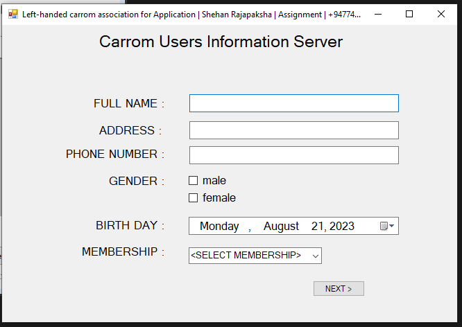

# Personal_Information_Saving_System
Personal Information  Saving System 

You can use this to find your or a friend's data as a text file.
Go to the <code>\HelloFutureSquareDev\HelloFutureSquareDev\bin\Debug</code> location and open the .he file there. You can run this project by opening...

### How to Use it?

<table>
  <tr>
    <td>1.)</td>
    <td>  </td>
  </tr>
  <tr>
    <td colspan='2'>Enter all the details as shown here. After that give the next prompt.. All the things in this window will be deleted and a new window will open..</td>
  </tr>
</table>
