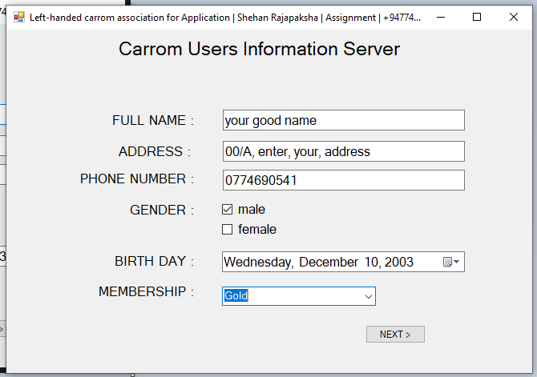
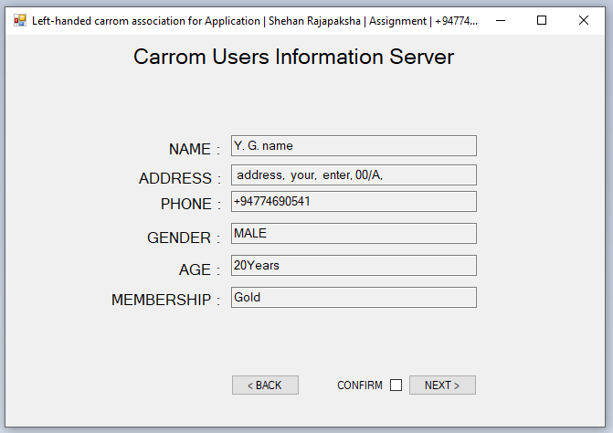
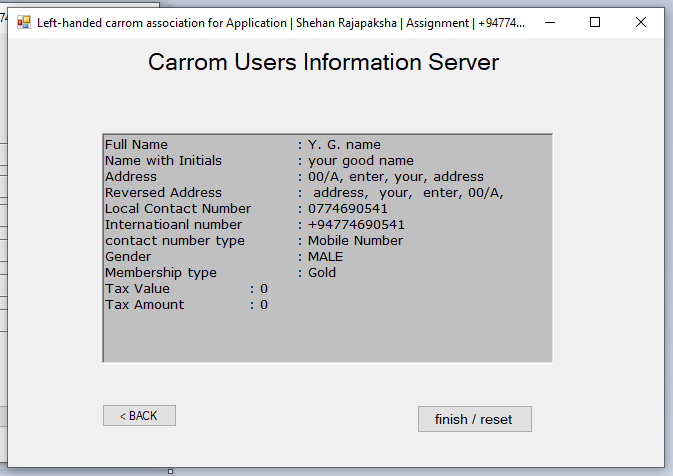

# Personal_Information_Saving_System
Personal Information  Saving System 

You can use this to find your or a friend's data as a text file.
Go to the <code>\HelloFutureSquareDev\HelloFutureSquareDev\bin\Debug</code> location and open the .he file there. You can run this project by opening...

### How to Use it?

<table>
  <tr>
    <td>1.)</td>
    <td>  </td>
  </tr>
  <tr>
    <td colspan='2'>Enter all the details as shown here. After that give the next prompt.. All the things in this window will be deleted and a new window will open..</td>
  </tr>
  <tr>
    <td>2.)</td>
    <td>  </td>
  </tr>
  <tr>
    <td colspan='2'>Enter your data in this as above</td>
  </tr>
  <tr>
    <td>3.)</td>
    <td>  </td>
  </tr>
  <tr>
    <td colspan='2'>In this second window that opens, the data you entered will be slightly adjusted and displayed. If it is not correct, you can go <b>"back"</b> and re-arrange using the back button.

    Before pressing next button give conworm a tick and give nexts.. then you can proceed.
  </tr>
  <tr>
    <td>4.)</td>
    <td>  </td>
  </tr>
  <tr>
    <td colspan='2'>
      Finally, the data you prepared will be prepared and a note will be given to you.. If you want to make more changes, you can go back and change them.

It can be reset by pressing Finish/Reset button.
    </td>
  </tr>
</table>

### Data Output
 
This text file will be created in the same location as the software.. This data will be saved in your computer with the next button given in the second instance.

